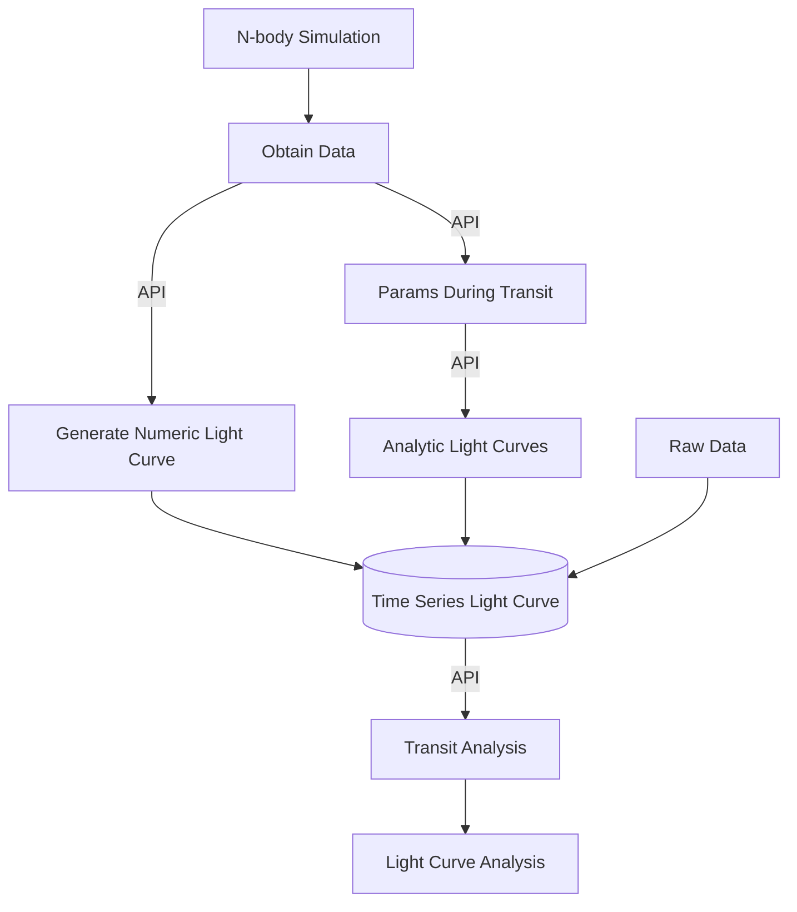

# KJRJMCMCMC

## Plan

## Test Cases
- Single Planet
- 2 Planet Stable
- Resonant 2 Planets
- Real Data with Params

## Development Management
### pre-commits
In the terminal
`
pre-commit run --all-files
`
will ensure that all files are correctly formatted and type hinted, if
errors. Please fix them yourself.

### Installing Packages
In the terminal 
`
poetry add [package_name]
`
or if package import already present in import
`
poetry install

